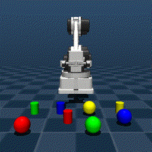
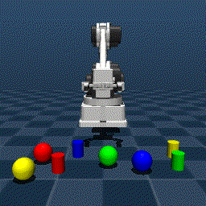
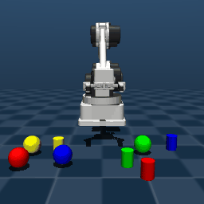
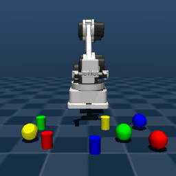
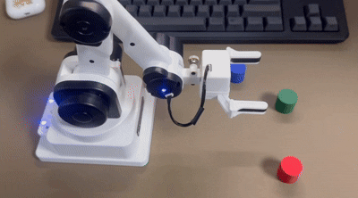

# OpenVLA RaccoonBot — Final

RaccoonBot OpenVLA 파이프라인에 **새로운 오브젝트 타입(sphere)**, **lift 태스크**,
**다양한 언어 지시문(5종)**, 그리고 **JPEG 압축·타이밍 로깅 기반 추론 최적화**를 추가한 확장판입니다.
추가로 시뮬레이션 정책을 **실물 RaccoonBot**에 연결해 동작을 확인했습니다.

Based on [KWU-FAIR-LAB/Raccoonbot_Openvla](https://github.com/KWU-FAIR-LAB/Raccoonbot_Openvla)

---

## 📁 Repository 구조

원본 파이프라인(clone 기준)에 과제 확장분을 추가한 형태입니다.
**학습/서버 코어(`openvla/`, `dlimp_openvla/`, `raccoon_env.py`, RLDS 빌더 등)는 원본 그대로 유지**했고,
확장은 **데이터 생성 스크립트**와 **클라이언트 레이어**에 집중했습니다.

### 과제 결과물 (추가/수정한 것)

| 파일 | 실행 위치 | 설명 |
|---|---|---|
| `openvla_extended_client.py` | 로컬 | **최종 클라이언트** — cylinder+sphere, grasp+lift, JPEG 압축, 타이밍 로그, 언어 지시 5종 |
| `openvla_multicolor_client.py` | 로컬 | 원본 baseline (before 비교용) |
| `openvla_multicolor_client_real_robot.py` | 로컬 | 실물 RaccoonBot 제어 클라이언트 |
| `rollout_visualize.py` | 로컬 | 추론 결과(프레임) → GIF 변환 |
| `Mujoco/raccoon_grasp_extended_dataset.py` | 서버 | 확장 grasp 데이터셋 (cylinder+sphere, 지시문 5종) |
| `Mujoco/raccoon_lift_dataset.py` | 서버 | lift 태스크 데이터셋 |
| `Mujoco/Raccoon_extended_scene.xml` | 서버/로컬 | sphere 4색 추가된 씬 |
| `Mujoco/visualize_episode_gif.py` | 서버 | 데이터셋 에피소드 → GIF |
| `episode_animation.gif`, `lift_animation.gif` | — | 데이터셋 에피소드 시각화 |
| `rollout_outputs/` | — | 추론 결과 (episode_000001-10 프레임 + ep1-10.gif + 로그) |
| `.gitignore` | — | 로그/시각화/대용량 제외 규칙 (원본에서 수정) |

> 원본 그대로(미수정): `openvla/`, `dlimp_openvla/`, `Mujoco/raccoon_env.py`,
> `Mujoco/RaccoonBot_S.xml`, `Mujoco/Raccoon_colored_cylinder.xml`, RLDS 빌더, `openvla_server.py`, `finetune.py`

---

## Assignment 1: Dataset Extension

### 1. New Object Type — Sphere
- MuJoCo 씬에 4색 sphere(red, blue, green, yellow) 추가
- 새 씬 파일: `Mujoco/Raccoon_extended_scene.xml`

### 2. New Task — Lift
- grasp 후 약 12cm 높이까지 들어올리는 lift 궤적 추가
- 새 데이터셋 스크립트: `Mujoco/raccoon_lift_dataset.py`

### 3. Diverse Language Instructions
오브젝트 타입별 단일 템플릿을 5종으로 확장 (데이터 생성 + 추론 클라이언트 모두 지원):
- **Grasp**: `grasp / pick up / grab / take / get the {color} {shape}`
- **Lift**: `lift / raise / pick up and hold / elevate / lift up the {color} {shape}`

### Dataset Statistics
| Dataset | Episodes | Objects | Tasks |
|---------|----------|---------|-------|
| raccoon_grasp_extended | 300 | cylinder + sphere (8 types) | grasp |
| raccoon_lift | 150 | cylinder + sphere (8 types) | lift |
| raccoon_mixed (combined) | 450 | cylinder + sphere | grasp + lift |

---

## Assignment 2: Code Improvement

### Extended Client — `openvla_extended_client.py`

원본 클라이언트(`openvla_multicolor_client.py`)는 cylinder grasp만 지원했습니다.
확장 클라이언트는 다음을 모두 통합한 최종 버전입니다.

| | 원본 (`openvla_multicolor_client.py`) | 확장 (`openvla_extended_client.py`) |
|--|--|--|
| 오브젝트 | cylinder 4색 | cylinder + sphere 8종 |
| 태스크 | grasp | grasp + lift |
| 언어 지시 | 1종 고정 | 5종 (`--instruction_variant`) + 직접 입력(`--instruction`) |
| 이미지 전송 | PNG (~27KB) | JPEG (~5KB, quality=50) |
| settle time | 0.8s | 0.5s |
| 추론 시간 | 측정 없음 | CSV 로그 + 요약 출력 |

#### 주요 개선 사항
1. **JPEG 압축**: 프레임당 ~27KB(PNG) → ~5KB(JPEG)로 전송량 약 5배 감소
2. **Settle time 단축**: 0.8s → 0.5s
3. **타이밍 로거**: `TimingLogger`로 스텝별 추론 시간을 CSV 기록, 에피소드 종료 시 평균/최소/최대 요약
4. **언어 지시 5종 추론**: `--instruction_variant`(0~4 / random) 또는 `--instruction`(직접 문장)으로 표현 변경

#### Sample Output
```
[SCENE] instruction='grab the red cylinder' | target=cylinder_red | target_xy=(-0.034, 0.218)
[IMG] PNG: 26.8KB → JPEG: 4.9KB
[TIMING] Step 000 | 추론시간: 0.541s | action: [-0.0056, 0.0028, -0.0007, ...]
[SUMMARY] Episode 1 완료
  총 스텝 수     : 50
  평균 추론 시간 : 0.23초
```

### (참고) 실물 RaccoonBot 연결 — `openvla_multicolor_client_real_robot.py`
시뮬레이션에서 동작하는 정책을 실물 RaccoonBot(COM 포트 연결)에 전달해 동작을 확인했습니다.
`--use_real_robot` 옵션으로 활성화하며, 안전을 위해 작은 `--max_delta_xyz`와 낮은 `--speed`부터 시작합니다.
(상세 실행은 아래 4-5 참고)

---

## Results

| | Before | After |
|--|--------|-------|
| Image size | ~27KB (PNG) | ~5KB (JPEG) |
| Settle time | 0.8s | 0.5s |
| Inference time | N/A | ~0.23s avg |
| Objects | cylinder only | cylinder + sphere |
| Tasks | grasp only | grasp + lift |
| Language templates | 1 | 5 |

- 추론 결과: `rollout_outputs/episode_000001` ~ `episode_000010` (프레임 PNG)
- 에피소드 시각화: `rollout_outputs/ep1.gif` ~ `ep10.gif`
- 추론 타이밍 로그: `rollout_outputs/logs/`

---

# 실행 가이드 (Setup & Run)

> ⭐ 1-3번은 직접 fine-tuning하는 과정입니다. 체크포인트를 불러와 추론만 하는 경우 **0번과 4번**만 진행하세요.
> 0-3번은 **server(Ubuntu GPU)**, 4번은 **local(클라이언트) + server(추론 서버)**에서 실행합니다.

## 0. Dependencies (server)
```bash
git clone https://github.com/kim-uisung/openvla-raccoonbot-final.git

apt update
apt install -y \
  libegl1 libgl1 libglvnd0 libglx0 libopengl0 \
  libgles2 libegl1-mesa libegl1-mesa-dev mesa-utils

cd openvla-raccoonbot-final/openvla
pip install .
```

로컬(클라이언트) 의존성:
```bash
pip install -r requirements.txt
```

## 1. Dataset 생성 (server)
```bash
cd Mujoco
python raccoon_grasp_multicolor_scene_dataset.py   # 원본 grasp
python raccoon_grasp_extended_dataset.py           # 확장 grasp (cylinder+sphere, 5종)
python raccoon_lift_dataset.py                     # lift
```

## 2. RLDS 변환 (server)
```bash
cd Mujoco/raccoon_dataset
python convert_raw_to_openvla_rlds_intermediate.py \
  --raw_root <수집한_데이터_경로> \
  --out_root ./openvla_rlds_intermediate \
  --val_ratio 0.1
```

## 2-1. TFDS builder (server)
```bash
cd Mujoco/rlds_dataset_builder/raccoon_pick_place
tfds build --overwrite
# 생성된 tensorflow_datasets 를 프로젝트 루트로 이동
```

## 3. OpenVLA Fine-tuning (server)
mixed 데이터셋(grasp + lift) 기준, `fair-lab/openvla-7b-finetuned-raccoonbot`에서 이어서 학습:
```bash
cd openvla
export PYTHONPATH=$(pwd):$PYTHONPATH

WANDB_MODE=disabled CUDA_VISIBLE_DEVICES=0 \
torchrun --standalone --nnodes 1 --nproc-per-node 1 vla-scripts/finetune.py \
  --vla_path /path/to/openvla-7b-finetuned-raccoonbot \
  --data_root_dir /path/to/tensorflow_datasets_mixed \
  --dataset_name raccoon_pick_place \
  --run_root_dir /path/to/openvla-runs \
  --adapter_tmp_dir /path/to/openvla-adapter-tmp \
  --lora_rank 32 --batch_size 4 --grad_accumulation_steps 4 \
  --learning_rate 5e-4 --max_steps 3000 --save_steps 3000 \
  --run_id_note raccoon-mixed-v1
```
→ 결과 체크포인트 예: `openvla-7b-finetuned-raccoonbot+raccoon_pick_place+...--raccoon-mixed-v1--image_aug`

## 4. Inference

### 4-1. (옵션) 사전 학습 모델 다운로드 — 직접 학습 안 한 경우 (server)
```bash
pip install -U huggingface_hub
hf download fair-lab/openvla-7b-finetuned-raccoonbot \
  --local-dir /path/to/openvla-runs/openvla-7b-finetuned-raccoonbot
```

### 4-2. 추론 서버 실행 (server)
직접 학습한 mixed-v1 체크포인트를 사용합니다 (긴 경로는 따옴표로 감싸기):
```bash
cd openvla
CUDA_VISIBLE_DEVICES=0 python openvla_server.py \
  --model_path "/path/to/openvla-runs/openvla-7b-finetuned-raccoonbot+raccoon_pick_place+b16+lr-0.0005+lora-r32+dropout-0.0--raccoon-mixed-v1--image_aug" \
  --default-unnorm-key raccoon_pick_place \
  --host 0.0.0.0 --port 8000 --device cuda
```
정상 시 출력: `[INFO] Available norm_stats keys: ['raccoon_pick_place']`

### 4-3. SSH 터널 (local)
서버 포트 8000이 직접 노출되지 않은 경우, 로컬에서 터널을 엽니다 (포트는 환경에 맞게):
```bash
ssh -L 8000:127.0.0.1:8000 -p <PORT> root@<SERVER_HOST>
```
이후 클라이언트는 `http://127.0.0.1:8000` 사용. **이 터미널은 닫지 않습니다.**

### 4-4. 클라이언트 실행 (local)

> ⚠️ **로컬 실행 폴더 구성**: 클라이언트가 동작하려면 아래 파일이 **같은 폴더**에 있어야 합니다.
> `openvla_extended_client.py`, `raccoon_env.py`, `Raccoon_extended_scene.xml`,
> `RaccoonBot_S.xml`, `assets/` (전체), `requirements.txt`

연결 확인:
```bash
curl http://127.0.0.1:8000   # {"detail":"Not Found"} 가 나오면 정상
```

기본 실행 (cylinder grasp):
```bash
python openvla_extended_client.py \
  --server_url http://127.0.0.1:8000 \
  --xml_path Raccoon_extended_scene.xml \
  --target_color red --target_shape cylinder --task_type grasp \
  --delta_scale 2.0 --max_delta_xyz 0.02 \
  --use_viewer --episode_id 1
```

> 💡 `--delta_scale 2.0 --max_delta_xyz 0.02`는 시뮬에서 팔이 충분히 움직이도록 하는 **재현 필수 옵션**입니다.
> (기본값 1.0 / 0.005로 두면 스텝당 이동이 작아 동작이 거의 안 보일 수 있음)

조합 예시:
```bash
# sphere grasp
... --target_shape sphere --task_type grasp --episode_id 5

# lift
... --target_shape cylinder --task_type lift --episode_id 9

# 언어 지시 5종 중 선택 (0=grasp,1=pick up,2=grab,3=take,4=get)
... --instruction_variant 2          # "grab the red cylinder"
... --instruction_variant random     # 매번 랜덤
... --instruction "grab the red cylinder"   # 문장 직접 지정
```

주요 옵션: `--target_color` [red/blue/green/yellow], `--target_shape` [cylinder/sphere],
`--task_type` [grasp/lift], `--instruction_variant` [0~4/random], `--instruction`,
`--delta_scale`, `--max_delta_xyz`, `--settle_seconds_per_action`(기본 0.5), `--image_quality`(기본 50).

### 4-5. (참고) 실물 RaccoonBot 연결 (local)
실물 RaccoonBot을 COM 포트로 연결한 뒤, `--use_real_robot`로 실제 동작을 수행합니다.
```bash
# 2) 정상 확인 후 전체 실행
python openvla_multicolor_client_real_robot.py \
  --server_url http://127.0.0.1:8000 \
  --xml_path Raccoon_colored_cylinder.xml --target_color red \
  --use_real_robot --max_delta_xyz 0.005 --speed 40
```
> 연결 시 로봇이 자동으로 home 자세로 이동하므로, 첫 실행 시 로봇 주변을 비워 두세요.

## 5. Visualization

### 5-1. 데이터셋 시각화 (server)
```bash
python Mujoco/visualize_episode_gif.py \
  --root /path/to/raccoon_grasp_extended \
  --output episode_animation.gif
```

### 5-2. 추론 결과 시각화 (local)
```bash
python rollout_visualize.py \
  --episode_dir rollout_outputs/episode_000001 \
  --output rollout_outputs/ep1.gif
```

---

## Demo

### Dataset — Grasp / Lift



### Inference Rollouts
 

### Real Robot
시뮬레이션에서 학습된 정책을 실물 RaccoonBot(COM 포트 연결)에 전달해 동작을 확인했습니다. (5배속)


